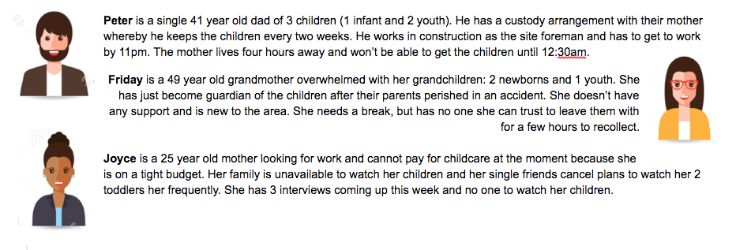

*Parents helping other parents to stay productive by swapping time!*
========
**Why Parent TimeSwap:**
Parent TimeSwap a space for parents to build an instant network of local parent support towards goals (i.e. school, interviewing, work, conferences, mental health break) by viewing the time availability of local parents, and setting up playdates to determine whether their families are a good fit to help one another during the available times listed. 


**User Target:** 
Parents and caregivers with children who may be busy and have responsibilities outside of parenting. This population may not have the funds, support from others, or knowledge of how to get support with filling in care gaps. Parents that have commitments and no one to watch their children in order to productively complete. Parents that don't have relatable or currently insecure support system in place. Parents that wish to connect with others for advices, mentorship, and friendship.

**User Stories:** 


----------------

**MVP (minimum viable product)**
====================

**Prioritization of Features:**
* Be able to create a profile
* Enter profile data
* Be able to query by zip code
* Be able to send message to another user

**Pages**
* Home
* Login
* About 
* Sign In
* Account Set Up
* Search Availability

**Project description:** 
A parents’ network helping other parents to stay productive by swapping time to help with each other’s children, schedule play dates, and build supportive relationships!

**APIs:** 
* Firebase (Authorization & Authentication)
* React (Context API)
* Pusher (Chatkit)

**Hardest part of building your project:** Setting up Private Rooms in Chat

**Favorite part of building your project:** Working with chatkit, securing authorization on specific pages, figuring out how to apply problem solving skills, watching page authentication breaking past blocks

**Built-with:** Node, Express, PostgreSQL, React, CSS, Bootstrap, Semantic UI

**Steps:**
 - [x] Database Schema  
  * User data
  * Zip codes
  * Number of children
  * Availability
 - [x] Firebase Authentication API
  * Creating user
  * Signing in existing user
  * Signing out authenticated user
  * Reset password
  * Change password
  * React-App Components
- [x] User Profiles
  * Existing Profiles in Cards
  * New / Create A Profile
- [x] Search Queries by Zip Code
- [x] Three GET queries: 
  * user default zip, 
  * user entered zip
- [x] Pusher ChatKit - Messaging between users
- [x] CSS
- [x] Code clean up
- [x] Tests
- [ ] Deploy to server

----------------

Set Up
==========
* Clone the repo
* Copy the package.jsons for client and server below
* `npm install`
* `npm start` on Client/ and `npm start` on root

Client/package.json
````
{
  "name": "my-app",
  "version": "0.1.0",
  "private": true,
  "dependencies": {
    "@pusher/chatkit-client": "^1.5.0",
    "babel-cli": "^6.26.0",
    "bootstrap": "^4.3.1",
    "firebase": "^5.9.4",
    "npm": "^6.9.0",
    "i": "^0.3.6",
    "materialize-css": "^1.0.0",
    "prop-types": "^15.7.2",
    "react": "^16.8.6",
    "react-bootstrap": "^1.0.0-beta.8",
    "react-dom": "^16.8.6",
    "react-icons": "^3.7.0",
    "react-materialize": "^3.3.0",
    "react-router-dom": "^5.0.0",
    "react-scripts": "3.0.0",
    "reactstrap": "^8.0.0",
    "recompose": "^0.30.0",
    "semantic-ui-css": "^2.4.1",
    "semantic-ui-react": "^0.86.0"
  },
  "scripts": {
    "start": "PORT=3000 react-scripts start",
    "build": "react-scripts build",
    "test": "jest --verbose",
    "test:watch": "jest --watchAll --verbose",
    "test:coverage": "jest --verbose --coverage",
    "eject": "react-scripts eject"
  },
  "eslintConfig": {
    "extends": "react-app"
  },
  "browserslist": [
    ">0.2%",
    "not dead",
    "not ie <= 11",
    "not op_mini all"
  ],
  "devDependencies": {
    "@babel/register": "^7.4.0",
    "babel": "^6.23.0",
    "babel-preset-env": "^1.7.0",
    "babel-preset-react-app": "^8.0.0",
    "dotenv": "^7.0.0",
    "enzyme": "^3.9.0",
    "enzyme-adapter-react-16": "^1.12.1",
    "enzyme-to-json": "^3.3.5",
    "ignore-styles": "^5.0.1",
    "jasmine": "^3.4.0",
    "jasmine-enzyme": "^7.0.2",
    "jsdom": "^15.0.0",
    "react-test-renderer": "^16.8.6"
  },
  "proxy": "http://localhost:3003",
  "babel": {
    "presets": [
      "react-app"
    ]
  },
  "jest": {
    "snapshotSerializers": [
      "enzyme-to-json/serializer"
    ]
  }
}
````
package.json (Server-side, but on root)
````
{
  "name": "react_firebase_profile_management",
  "version": "1.0.0",
  "description": "\"app shell with postgres, express and react\"",
  "main": "server.js",
  "scripts": {
    "test": "echo \"Error: no test specified\" && exit 1",
    "start": "node Server_pg/server.js"
  },
  "repository": {
    "type": "git",
    "url": "git+https://github.com/daaimah123/React_Firebase_Profile_Management.git"
  },
  "author": "Daaimah Tibrey",
  "license": "MIT",
  "bugs": {
    "url": "https://github.com/daaimah123/React_Firebase_Profile_Management/issues"
  },
  "homepage": "https://github.com/daaimah123/React_Firebase_Profile_Management#readme",
  "dependencies": {
    "@pusher/chatkit-client": "^1.5.0",
    "@pusher/chatkit-server": "^1.1.0",
    "body-parser": "^1.18.3",
    "cors": "^2.8.5",
    "create-react-app": "^2.1.8",
    "dotenv": "7.0.0",
    "express-generator": "^4.16.0",
    "express-pino-logger": "^4.0.0",
    "node-env-run": "^3.0.2",
    "nodemailer": "^6.1.1",
    "nodemon": "^1.18.10",
    "npm-run-all": "^4.1.5",
    "pg": "^7.9.0",
    "pino-colada": "^1.4.4",
    "twilio": "^3.30.2"
  },
  "devDependencies": {}
}
````
----------------

**Choices Made:**
* Removed multiple search options and narrowed down to two search requests
* User Profile Cards vs Entire Profile - ruled out having to populate a new endpoint for each user
* Firebase to authenticate and authorize
* Chat Room - Start at Public & Buttons to Make Private vs starting in private chat room with name clicked on from search
* Chat Username Screen - user manually enters desired chat name (tradeoff, not currently a saved or remembered username so user must remember/re-enter each time entering chat)


**Next Steps:**
* leave the chat room link
* remove username form, autogenerate username into private room with another user when click chat link from search card
* is there research / facts that can be added to about page?
* allow user to edit their profile and update database
* email or send text button (will not reveal info to other users) to send connection request
  
**Challenges:**
Creating a private chat room from chatkit - I had the docs to help me design the function needed to create a room and wasnt abel to generate a working room. I had a difficult time connecting the logic for how I wanted the room to generate, so i broke down the logic:
````
logged in user clicks button --> button generates room between logged in user and clicked user --> room populates in room list for the two users
````
I then had to figure out how to get the private room over to the 'clicked user' and into the room list component. I eventually saw that I was creating the room, but was unable to see which users were being passed in because I hadn't passed the property set on whos online list component to both components in whos online list file. Fixing this helped to show the prescence of which users were in the newly created rooms.
